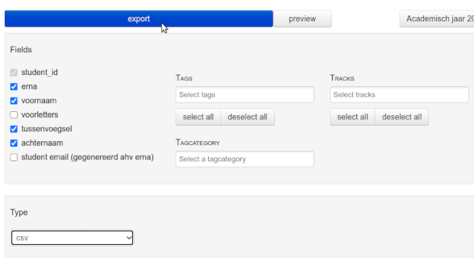

# Email Feedback SPSS Exam

Python-based application for sending question-by-question email feedback 
about the results in an SPSS exam.

*Released under the MIT License*

Oliver Lindemann, Erasmus University Rotterdam, NL

 

 

---

# Installation

## Python 

Users who are familiar with Python should download the source, install the 
dependencies and run the python file `email_feedback_spss_exam.py`. This 
method is suggested.

**Dependencies**

Python 3.5+ and the following libraries:
* Pandas
* PySimpleGUI
* appdirs
* mailcomposer
* Markdown

## Windows

Windows user may run the application without installing Python. Download the 
latest executable file, `email_feedback_spss_exam.exe`, via the
[release website](https://github.com/essb-mt-section/email-feedback-spss-exam/releases/latest)
and execute it.

# Usage

1. Export results CSV (see below) and select the file in the application.
2. Change the text in the email settings
3. Select *directly via SMTP* and enter your email credentials
4. Enter an email address for sending a **test email** (e.g. to yourself). 
   The test email is a feedback email from a randomly selected student. 
5. If the feedback email like you want to, select or enter IDs of students 
   that should receive the feedback
6. Click on `Send directly via SMTP`    

## How to export results CSV correctly?

Select your SPSS exam on the EOB website of the EUR and click 
`Export/with details advanced`:

 

Select the fields *'erna'*, *'voornaam'*, *'tussenvoegsel'* and 
*'acternaam'*  and click on export: 

 

## Two-factor authentication and Gmail

A two-factor authentication (OAuth) for the SMTP server is not implement in this app. 
You may therefore use a Gmail account (with so-called app password) for sending emails
and add your university address as reply-to. 

To send the feedback via Gmail, generate first an app password for mails 
using this [link](https://myaccount.google.com/apppasswords). Remember the password and
add it as SMTP password in the settings dialog. Passwords will not be saved by the app.

---
**Bugs**: Please [submit](https://github.com/essb-mt-section/email-feedback-spss-exam/issues/new)
any bug you encounter to the Github issue tracker.

